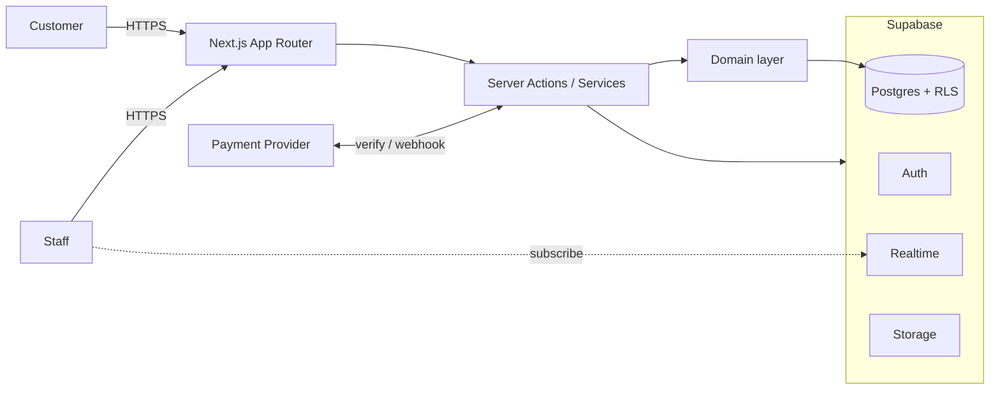

# لغات البن — Coffee Languages

نظام طلب واستلام من السيارة (Curbside Ordering) لمقهى **لغات البن**.

> اطلب بسرعة → ادفع → أنا بالطريق → وصلت → نتعرف على سيارتك → نسلم الطلب.

المواقف المحيطة عامة — لا رقم موقف، لا QR لكل موقف، لا تخصيص Car Pickup spots.

---

## Product overview

| | |
|---|---|
| Brand | لغات البن / Coffee Languages |
| Locale | `ar-SA` · RTL · `Asia/Riyadh` · SAR |
| Customer | Guest checkout + anonymous token |
| Staff | Supabase Auth + roles |
| Payments | `PaymentProvider` abstraction (Mock → Moyasar/Tap/HyperPay) |

### Customer journey

```
QR / Link → Menu → Cart → Payment → Confirmed → Preparing
→ (أنا بالطريق) → وصلت → Car confirm → Flasher → Staff → Delivery → Repeat
```

### Repeat visit

```
QR → نفس طلبك؟ → دفع → وصلت → استلام
```

---

## Architecture



**Principles**

- Thin UI + explicit domain layer
- Database is source of truth; Realtime is UX-only (refetch on reconnect)
- Authoritative server-side pricing — never trust client totals
- Optimistic concurrency on status transitions (`UPDATE … WHERE status = expected`)
- RLS on every table; service role only for privileged server ops

```
src/
  app/           # routes (order, staff, admin, api)
  components/    # thin UI
  domains/       # pricing, state machine, payments, availability
  lib/           # supabase, auth tokens, money, logging, rate-limit
  server/        # actions + services
  types/
supabase/
  migrations/
  seed.sql
```

---

## Database model (core)

| Table | Purpose |
|---|---|
| `store_settings` / `store_hours` | Capacity, pause, tax, prep baseline |
| `categories` / `products` | Menu |
| `modifier_groups` / `modifier_options` / `product_modifier_groups` | Modifiers |
| `anonymous_customers` | Guest identity (token hash) |
| `customer_vehicles` | Saved cars (make/model, color, plate hint) |
| `checkout_sessions` | Idempotent checkout intents |
| `orders` / `order_items` / `order_item_modifiers` | Orders + snapshots |
| `order_events` | Audit log |
| `payments` | Provider payments + idempotency |
| `profiles` | Staff roles |

Money is **integer minor units** (18 SAR = `1800`).

---

## Order state machine

```
PENDING_PAYMENT → PAID → ACCEPTED → PREPARING → READY
→ CUSTOMER_ARRIVED → OUT_FOR_DELIVERY → DELIVERED
```

`ON_MY_WAY` is an event/flag (`customer_on_the_way`), not a primary status.

Terminal: `CANCELLED`, `REFUNDED`.

Transitions via `transition_order()` RPC with compare-and-update.

---

## RLS model

- **Anon**: active menu, store settings/hours. **Cannot** list orders, phones, payments.
- **Staff**: operational order read/update + events.
- **Manager**: menu + store.
- **Admin**: profiles + full access.
- Sensitive customer writes go through **server + service role** with hashed access tokens.

---

## Payments

```ts
interface PaymentProvider {
  createPayment()
  verifyPayment()
  handleWebhook()
  refundPayment()
}
```

- `MockPaymentProvider` for local/test only — **refused in production** unless explicitly allowed.
- Webhook: signature verify → amount/currency check → idempotent `PAID` transition.
- Never trust redirect alone.

---

## Vehicle identification

1. Customer arrived event  
2. Make/model snapshot  
3. Color snapshot  
4. Flasher visual confirm  
5. Optional plate hint (last 3)

Location hint only after staff presses **ما لقيت السيارة** (progressive disclosure).

---

## Order types

| Type | Identity | Kitchen path |
|---|---|---|
| `CURBSIDE` | Vehicle snapshots | READY → (arrival) → DELIVERED |
| `DINE_IN` | `table_id` + `table_session_id` | READY → DELIVERED |

Table QR URL: `/order/menu?table=<opaque-token>` (never embeds table number).

---

## Local setup

```bash
npm install
cp .env.example .env.local
# fill NEXT_PUBLIC_SUPABASE_URL, NEXT_PUBLIC_SUPABASE_ANON_KEY, SUPABASE_SERVICE_ROLE_KEY

# With Docker + Supabase CLI:
npx supabase start
npx supabase db reset   # migrations + seed.sql

npm run dev
```

### Commands

| Command | |
|---|---|
| `npm run dev` | Next.js dev server |
| `npm run lint` | ESLint |
| `npm run typecheck` | `tsc --noEmit` |
| `npm test` | Vitest unit tests |
| `npm run test:e2e` | Playwright happy path |
| `npm run build` | Production build |

### Supabase hosted project

Project: `lughat-albun` (`npjdciktodzwykyjmyvo`, `eu-central-1`).

Schema applied via migrations in `supabase/migrations/`. Seed in `supabase/seed.sql`.

---

## Testing

**Unit:** pricing, tax, modifiers, availability, state machine, prep estimate, mock payments, service-role leak guard.

**E2E:** `tests/e2e/curbside-happy-path.spec.ts` — QR → latte → pay → staff → arrive → deliver.

Requires `SUPABASE_SERVICE_ROLE_KEY` for full checkout E2E.

---

## Deployment

- **App:** Vercel — set env vars from `.env.example`. Bind to platform URL as `APP_URL`.
- **DB:** Supabase hosted. Run migrations before first deploy.
- Set `PAYMENT_PROVIDER` to a real provider before production traffic.
- Keep `ALLOW_MOCK_PAYMENTS_IN_PRODUCTION=false`.

### Production checklist

- [ ] Service role **not** in any `NEXT_PUBLIC_*` var
- [ ] RLS enabled on all tables (verify with advisors)
- [ ] Real payment provider + webhook secret
- [ ] Staff users created in Auth + `profiles` rows (`is_active=true`)
- [ ] Store hours / capacity tuned
- [ ] `npm run build` + `npm test` + E2E green
- [ ] Printable QR from `/admin/qr` posted at entrance

---

## Security notes

- Order access requires opaque token (cookie / `?t=`); public number alone is insufficient.
- Token stored as SHA-256 hash only.
- Structured logs redact tokens, phones, card data, service role.
- Rate limits on checkout, arrival, order access.

---

## Known limitations (MVP)

- No Docker in this cloud agent environment → `supabase start` / local `db reset` not verified here; remote project used instead.
- Staff seed user must be created manually in Supabase Auth + `profiles`.
- Real Apple Pay / Mada rails not wired — Mock provider only until Moyasar/Tap/HyperPay adapter.
- Analytics dashboard is lightweight (P1).
- P2 (PWA, push) deferred by design.
